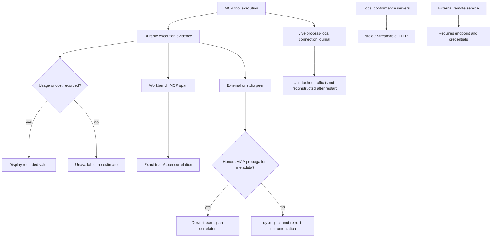

# qyl.mcp

qyl.mcp is a local MCP developer workbench for connecting to real servers,
inspecting their negotiated protocol surface, invoking tools safely, and
retaining execution and evaluation evidence. It also includes Qyl telemetry
tools and MCP Apps for exploring a live Qyl collector.

This repository is the sole MCP runtime and MCP workbench owner in the Qyl
workspace. It owns the default loopback listener on `18888`; the sibling C#
host owns collector and diagnostics orchestration on its separate host API.

The browser, runner API, and managed MCP processes run with the local user's
permissions. The runner binds only to loopback; it is not an Internet-facing
multi-user service.

## Quick start

Node.js 22.12 or newer is required.

```bash
npm ci
npm run build
npm run start:runner
```

Open <http://127.0.0.1:18888>. Set `QYL_MCP_RUNNER_PORT` to use another local
port. For live Qyl data, configure the collector before
starting the runner:

```bash
export QYL_COLLECTOR_URL=http://127.0.0.1:5100
export QYL_API_KEY='your-collector-key' # omit for an unsecured local collector
npm run start:runner
```

The dashboard bootstraps an opaque `HttpOnly`, `SameSite=Strict` loopback
session. Session tokens are hashed in memory, never returned in API payloads,
and do not survive a runner restart. Host and browser-origin checks protect the
loopback API from DNS rebinding and cross-origin requests.

Workbench state defaults to `~/.qyl/mcp-workbench.json`; override it with
`QYL_MCP_STATE_PATH`. Workspaces, server definitions, preferences, executions,
protocol evidence, tests, suites, evaluation runs, and exports are written by
atomic replacement with mode `0600`; an app-created parent directory uses mode
`0700`, while an explicitly supplied existing parent is left unchanged. Active work
interrupted by a restart is restored as explicit failure evidence.

## Connect an MCP server

Choose **Add server** in the sidebar. User-created connections support the two
client transports below; runner-registered built-ins are visible but cannot be
created from the browser.

| Transport | Configuration |
| --- | --- |
| Streamable HTTP | Credential-free HTTP(S) endpoint plus header references such as `Authorization=MCP_TOKEN|bearer` |
| stdio | Command, one argument per line, optional working directory, and environment mappings such as `SERVER_TOKEN=MCP_SERVER_TOKEN` |

Set referenced values in the runner environment before startup:

```bash
export MCP_TOKEN='remote-service-token'
export MCP_SERVER_TOKEN='child-process-token'
npm run start:runner
```

Only environment-variable names are sent by the browser or persisted. Values
are resolved in the runner at connection time and registered with the shared
redactor. Remote endpoints cannot embed credentials, query values, or fragments;
persistent `Cookie` headers are rejected. Stdio credentials cannot be placed in
command arguments. Starting or reconnecting a stdio server requires review of
the exact executable, arguments, working directory, and environment references
because it launches code with the current user's permissions.

### Protocol revision

The runner uses the MCP v2 split packages. Every user-configured stdio and
Streamable HTTP connection pins protocol revision `2026-07-28` and fails when a
peer cannot negotiate it; there is no fallback or negotiation setting. The
built-in Qyl server uses the SDK's legacy-only in-memory transport internally,
which is not a user-configurable or network-facing connection. A Streamable
HTTP conformance test verifies `server/discover`, modern-era identity, and the
absence of `initialize`.

## Workbench workflow

After initialization, the workbench retains the negotiated protocol version,
server identity, capabilities, instructions, and session information. Discovery
collects paginated tools, resources, resource templates, and prompts; it can be
refreshed without replacing the last useful snapshot on failure.

For each tool, the inspector shows its complete input schema and annotations.
The invocation composer keeps a generated form and raw JSON view synchronized,
validates input before submission in a deadline-bounded worker, applies a
bounded execution timeout, and includes an idempotency key. JSON Schema and
pattern assertions use the same isolated validation path; the browser never
compiles a server-supplied regular expression. Results preserve MCP text,
image, audio, embedded-resource, resource-link, and structured-content shapes
while blocking unsafe URLs and active content.

Each persisted execution exposes its request, result or typed error, lifecycle,
duration, attempts, cancellation state, redacted JSON-RPC timeline, and Qyl
observability evidence. Live protocol and execution streams use resumable event
identifiers; cancellation aborts the in-flight SDK request.

The qyl.mcp server also records inbound `tools/call` requests natively, including
when it is connected directly over stdio or hosted Streamable HTTP rather than
invoked through the workbench. The SDK-validated result, lifecycle, duration,
redacted JSON-RPC request/result timeline, and trace/span correlation are
written atomically to `~/.qyl/mcp-native-executions.json`; set
`QYL_MCP_NATIVE_STATE_PATH` to choose another file. The newest 1,000 executions
are retained. Results below two million serialized characters are preserved in
full after credential redaction; larger durable results are replaced by an
explicit truncation result. Timeline payloads and request metadata are bounded
separately so they do not duplicate large results. Token usage and cost are
retained only when a tool reports explicit structured evidence—qyl.mcp never
derives them from prose, latency, or payload size.

Server and workspace deletion is serialized against ordinary mutations.
Deletion is rejected while relevant executions are active or evaluation
evidence still references the server; terminal standalone execution records
are removed with the server so durable state cannot outlive its owner.

The tests workspace persists real tool invocations with status, exact, partial,
JSON Schema, pattern, and latency assertions. Suites run with bounded
concurrency and optional fail-fast behavior. Completed runs can be compared
within the same suite and exported as contract-validated JSON or a Markdown
report with artifact size and SHA-256 evidence.

### Safety model

MCP tool annotations are treated as hints. Only a tool explicitly marked
read-only, non-destructive, and closed-world can run without confirmation.
Missing, contradictory, mutating, destructive, or open-world hints require the
user to review and approve the exact call. Test and suite runs retain their
run-level approval; the runner never synthesizes confirmation. Arguments,
results, protocol payloads, persisted evidence, diagnostics, and telemetry pass
through credential and URI redaction.

## Qyl observability and MCP telemetry

The built-in `qyl-telemetry` server reads real traces, logs, and sessions from
`QYL_COLLECTOR_URL`. `QYL_API_KEY`, when present, is sent using the
header defined by the generated Qyl API contract. Every correlated read runs
under async self-export suppression, so inspecting Qyl evidence does not create
recursive MCP telemetry.

qyl.mcp exports correlated MCP operation spans, duration histograms, and
metadata-only operation logs over OTLP. The current Qyl collector accepts and
discards metrics, so its generated read contract and workbench correlation
response expose only retained trace and log evidence.

| Variable | Purpose |
| --- | --- |
| `QYL_COLLECTOR_URL` | Qyl read API base URL; default `http://127.0.0.1:5100`. Also used as the OTLP base when set. |
| `QYL_API_KEY` | Collector read and OTLP credential. |
| `QYL_OTLP_ENDPOINT` | Optional OTLP base URL for workbench self-telemetry. |
| `QYL_MCP_TELEMETRY=0` | Disable native-server and workbench MCP spans, metrics, and operation logs. Telemetry is enabled otherwise. |
| `QYL_MCP_CAPTURE_CONTENT=1` | Include redacted, size-bounded MCP request and response bodies in operation logs. Disabled by default. |
| `QYL_MCP_STATE_PATH` | Override the durable workbench JSON path. |
| `QYL_MCP_NATIVE_STATE_PATH` | Override the durable native-server execution evidence path. |

Signal-specific `OTEL_EXPORTER_OTLP_TRACES_ENDPOINT`,
`OTEL_EXPORTER_OTLP_METRICS_ENDPOINT`, and
`OTEL_EXPORTER_OTLP_LOGS_ENDPOINT` take precedence. Otherwise the base order is
`QYL_OTLP_ENDPOINT`, `QYL_COLLECTOR_URL`,
`OTEL_EXPORTER_OTLP_ENDPOINT`, then `http://127.0.0.1:4318`.

### Pinned MCP semantic surface

The implementation targets OpenTelemetry semantic conventions v1.43.0 and its
development MCP conventions.

- `mcp.client` and `mcp.server` spans are named `{mcp.method.name} {target}`
  when a low-cardinality tool or prompt target exists. They cover requests and
  notifications and never put argument or result content in attributes.
- `mcp.client.operation.duration` and `mcp.server.operation.duration`
  histograms carry the upstream dimensions. Failures use `error.type` on the
  same operation histogram rather than a second counter.
- The local `qyl.mcp.operation` log event carries matching trace/span context. Its
  body is metadata-only unless `QYL_MCP_CAPTURE_CONTENT=1`; opted-in payloads
  are redacted and bounded before export.

Operations start before SDK dispatch. Standard W3C trace context and baggage,
plus fields from a host-configured propagator, travel in the unprefixed MCP
`params._meta` bag on every supported transport. An inbound MCP server span uses
that remote context as its parent (or starts as a root when none is valid) and
links any independent ambient transport span. HTTP/SSE propagation remains a
separate instrumentation concern and is never replaced by the MCP carrier.

The method vocabulary follows the active MCP SDK registry rather than a copied
list in qyl.mcp.

## Explicit demo mode

Collector errors remain errors; live mode never falls back to generated data.
For an offline demonstration, enable demo mode deliberately:

```bash
QYL_DEMO=1 npm run start:runner
```

Demo tool results carry `mode: "demo"` so consumers can label them. The
workbench itself still uses real local persistence and MCP execution paths.

## Standalone Qyl MCP server

The installable server can be connected directly to a chat client over stdio:

```bash
node server/dist/main.js --stdio
```

After `npm run build`, `npm start` launches this standalone HTTP server. Without
`--stdio`, it serves stateless Streamable HTTP on
`http://127.0.0.1:3001/mcp` by default; set `PORT` to change the port. The v2
`createMcpHandler` and `serveStdio` entries accept only protocol revision
`2026-07-28`; older openings are rejected.
The local default binds only to loopback and accepts local or absent browser
origins. It uses the same `QYL_COLLECTOR_URL`, `QYL_API_KEY`, and `QYL_DEMO`
configuration. `QYL_API_KEY` is only an outgoing collector credential; it does
not authenticate incoming MCP clients. The model-visible tools are
`display_traces`, `display_mcp_dashboard`, `list_traces`, `get_trace`,
`list_sessions`, `search_logs`, and `ci_log`; `fetch_telemetry` is reserved for
the bundled MCP Apps.

The workbench runner remains available with `npm run start:runner`.

### Hosted standalone server

The reference deployment serves a public product page at
`https://mcp.qyl.at/`, the canonical MCP endpoint at
`https://mcp.qyl.at/mcp`, and `/healthz` as its platform healthcheck; pushes to
`main` deploy automatically after CI passes. The root page is presentation
only and never acts as a second MCP endpoint.

Hosting is opt-in and authenticates as an OAuth 2.1 Resource Server backed by
Auth0. Configure an Auth0 API with identifier `https://mcp.qyl.at/mcp`, RS256,
the RFC 9068 access-token profile, Resource Parameter Compatibility Profile,
and permission `qyl:read`. For stock third-party MCP clients, enable Auth0's
strict Dynamic Client Registration and grant `qyl:read` as the API's default
user-delegated permission; enable Client ID Metadata Document Registration
separately and promote the login connection to domain level. qyl itself hosts
neither client registration nor an authorization server. Production uses
`MCP_OAUTH_ISSUER=https://qyl-eu.eu.auth0.com/`. The server discovers the
issuer at startup, verifies RFC 9068 bearer tokens against its JWKS, requires
the exact resource audience and `qyl:read` scope, and publishes only the RFC
9728 protected-resource document. It never mints tokens and keeps no static
operator credential; startup fails closed when the issuer is unset or
unreachable.

```bash
NODE_ENV=production \
MCP_BIND_HOST=0.0.0.0 \
MCP_PUBLIC_URL=https://mcp.qyl.at \
MCP_ALLOWED_HOSTS=mcp.qyl.at,<service>.up.railway.app,healthcheck.railway.app \
MCP_ALLOWED_ORIGIN_HOSTS=mcp.qyl.at,<service>.up.railway.app \
MCP_OAUTH_ISSUER=https://qyl-eu.eu.auth0.com/ \
QYL_COLLECTOR_URL=http://qyl-collector.railway.internal:5100 \
QYL_API_KEY='<collector-api-key>' \
npm start
```

`MCP_PUBLIC_URL` adds its hostname to the SDK's Host and Origin host allowlists
and, as `<public-url>/mcp`, is the fixed resource identifier tokens are
audience-bound to. A non-loopback bind requires `MCP_PUBLIC_URL`. Additional
comma-separated hostnames support Railway's generated domain and healthcheck
host. Native clients without an Origin header remain valid, but every hosted
MCP request needs a valid issuer-minted `Authorization: Bearer ...` token.

The repository includes `railway.toml`. In Railway, use `/` as the root
directory, or equivalent settings:

```text
Build:  npm run build --workspace server
Start:  node server/dist/main.js
Health: /healthz
```

Do not set `PORT` manually; Railway injects it. The standalone server reads it
and binds to the configured `MCP_BIND_HOST`. The stateless server needs no
volume and can later be scaled horizontally. Keep one replica initially while
authentication, rate limits, and collector load are being tested. Railway's
15-minute streaming request limit still applies to unusually long synchronous
MCP operations; those should eventually use polling or resumable jobs.

Qyl request, response, event, and error models come from
[`qyl-api-schema`](https://github.com/ANcpLua/qyl-api-schema). MCP envelopes come
from the official MCP SDK, and OTLP payloads come from the official
OpenTelemetry SDK.

## Verification

Run the repository-native checks from the root:

```bash
npm ci
npm run build
npm test
npm run smoke
npm run smoke:otlp
```

`smoke` exercises explicit demo behavior. `smoke:otlp` requires the sibling Qyl
collector checkout (or `QYL_COLLECTOR_PROJECT` pointing to its project), starts
an API-key-protected collector, and exercises its official OTLP/protobuf and Qyl
read surfaces.

## Current limitations

- Evaluation usage and cost are displayed only when the execution evidence
  records them; qyl.mcp does not synthesize or estimate missing values.
- Downstream spans from an external or stdio server correlate only when that
  server honors the MCP propagation metadata; qyl.mcp cannot retrofit
  instrumentation into an uninstrumented peer.
- The live connection journal is process-local. Execution, test, and evaluation
  evidence is durable, but protocol traffic that is not attached to retained
  execution evidence is not reconstructed after a runner restart.
- Local conformance servers cover stdio and Streamable HTTP. External
  remote services cannot be verified without their endpoints and credentials.


